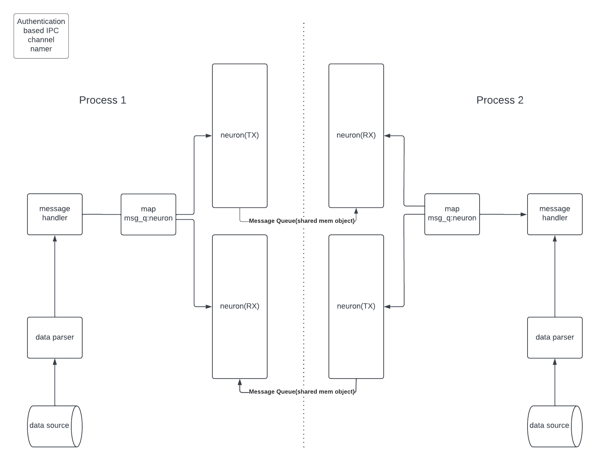

# An inter-process message queue
##### The concept this experiment was trying to play with has already been addressed. A working and production ready implemenation with a maintained solution is @ https://github.com/grpc  

 This is an experiment to use a boost library feature as a process interface that can produce and consume pre formatted messages. The idea is to define a protocol that can exchange changes in configuration from one process to the next without an explicit notify or call back.
 
 ##### Current challanges:
* Security - if a process has the same level of read/write permissions and knows the message queue name then messages can be consumed by the incorrect process or invalid messages can be added to the queue
* Subscriber management - currently handled only at the individual process level
  
  
# Build  
  Setup:  
  sudo apt install libc6-dev g++ libboost-all-dev   

## Compile:  
  g++ --std=c++17 -pthread msg-hanlder.cpp -o msg-handler -lboost_serialization -lrt  

## C++ binary demo use
  msg-handler rx  
  msg-handler tx  
  TYPE MSG content to be sent + RETURN 

# Using the C++ IPC as a python precompiled library  

## Install SWIG Ubuntu  
  sudo apt update  
  sudo apt install swig python3-dev gcc pip libboost-all-dev  
  python -m pip install --upgrade setuptools  

  get setup.py file  

## Compile:
  $ swig -c++ -python pythonconnector.i  
  $ python3 setup.py build_ext --inplace  
  $ pip install example

## Add to include path:
  ${workspaceFolder}/**
  /usr/include/c++/9
